# CI&CD
## What is CI(Continuous Integration?)&CD(Continuous Deployment & Continuous Delivery)?
### CI
Continuous Integration (CI) is a development practice where developers integrate code into a shared repository frequently, preferably several times a day. Each integration can then be verified by an automated build and automated tests. While automated testing is not strictly part of CI it is typically implied.

### Benefit
One of the key benefits of integrating regularly is that you can detect errors quickly and locate them more easily. Martin Fowler, Chief Scientist, ThoughtWorks says:
>*Continuous Integration doesn’t get rid of bugs, but it does make them dramatically easier to find and remove.*

### CD
Additionally, Continuous Deployment and Continuous Delivery have developed as best-practices for keeping your application deployable at any point or even pushing your main codebase automatically into production whenever new changes are brought into it. This allows your team to move fast while keeping high quality standards that can be checked automatically.

### Difference between them
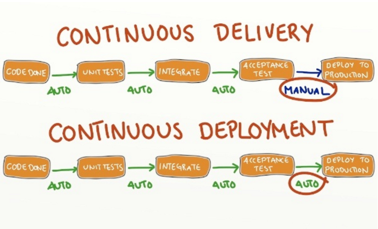

# Our trial
## CI
Use Jenkins+Github to build CI

1、Download and install Jenkins

2、Set the environment for Jenkins

    1.JDK setting

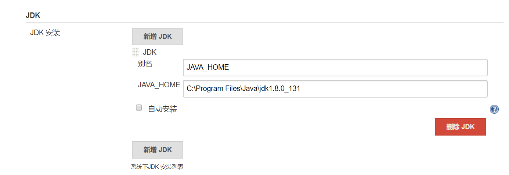
  
Type in the path of JDK on PC

     2.git setting

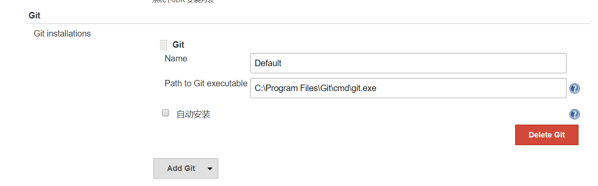

Type in the path of git on PC（require installation previously）
    
3、Add plugins on Jenkins

     1.git plugin 和 github plugin
       (Just choose the recommended ones is okay. ）

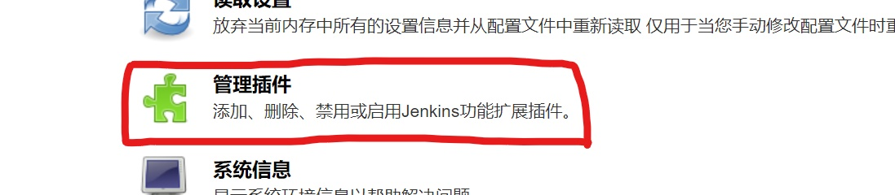

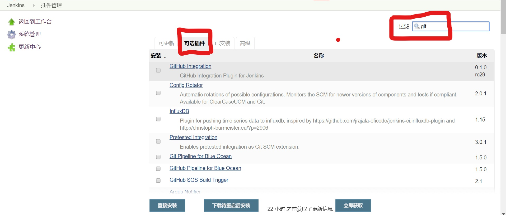
If we want other plugins, find them in Pluggins Available

4.Create a project

     1.Name it
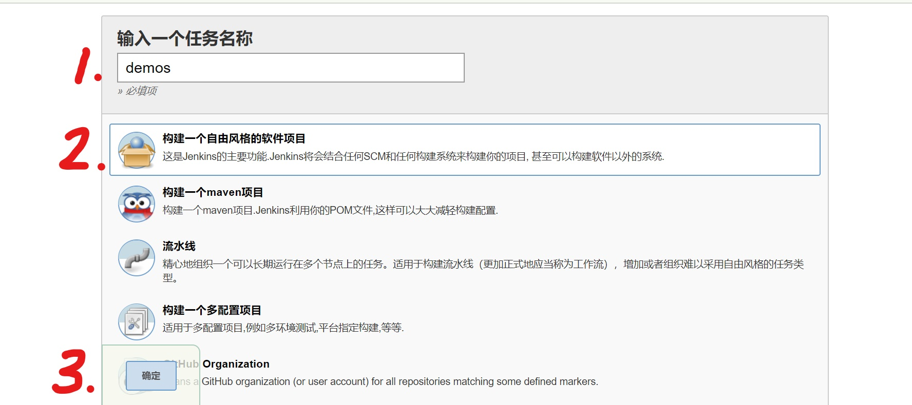

     2.Settings

    
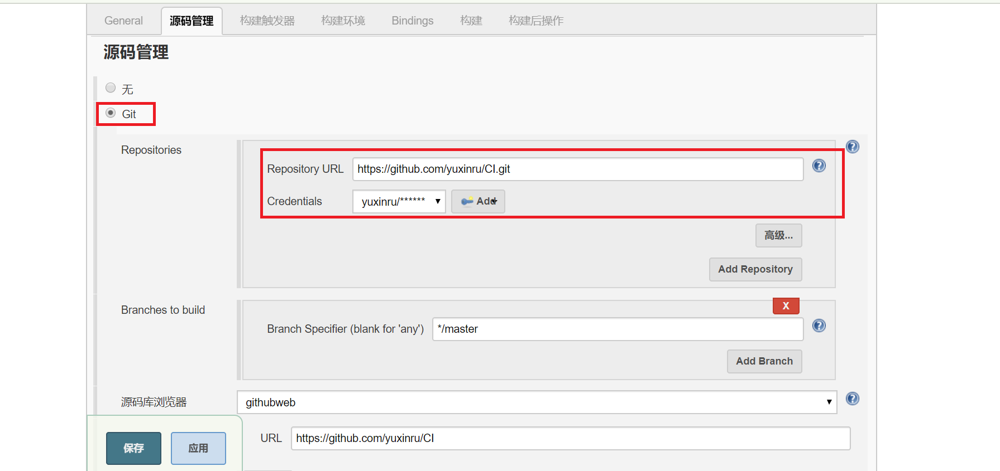
{

     Note：
    ①As we choose Github as the source of our code，we choose git here
    ②Write the repository url which ended in .git，not the url of webbrowser

}
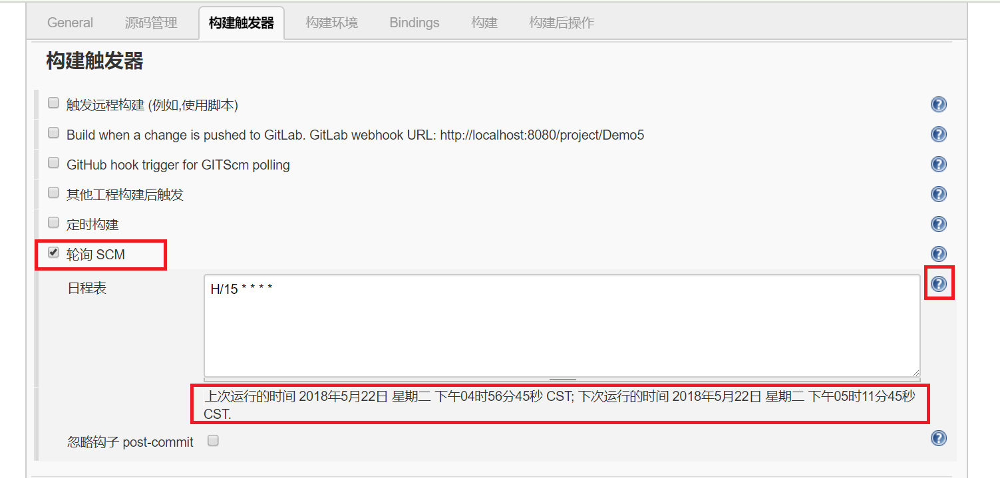
{

    Note：
    ①Choose ??? SCM，we can build it at set intervals
    ②The detailed information will be shown by clicking the "?" in the column

}
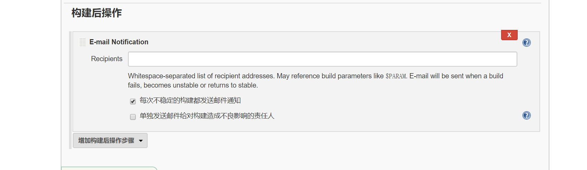

{

    Note：
    ①We can make it send email to us every time it builds
}

5.Save

Then a CI is done

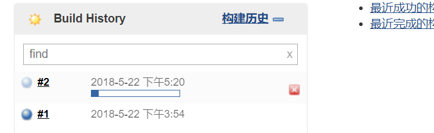

## CD
### Tool: heroku (along with git, heroku cli)

### Proccess:
- Login with heroku
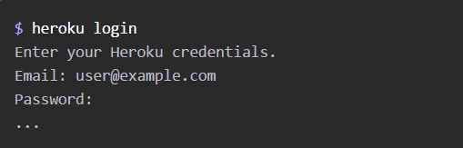
- Clone the application from github repo to local
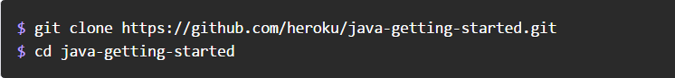
- Create an app on Heroku, which prepares Heroku to receive source code
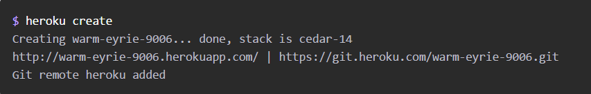
- Make changes and run locally for test

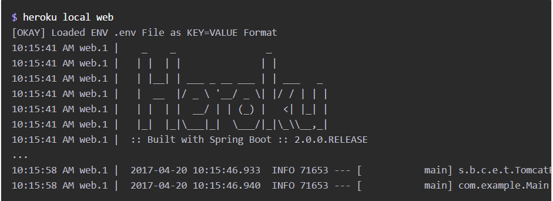
- Add the modified files to the local git repository

- Commit the changes to the repository

- Deploy

- Open the website

- We will find that our demo now runs on heroku
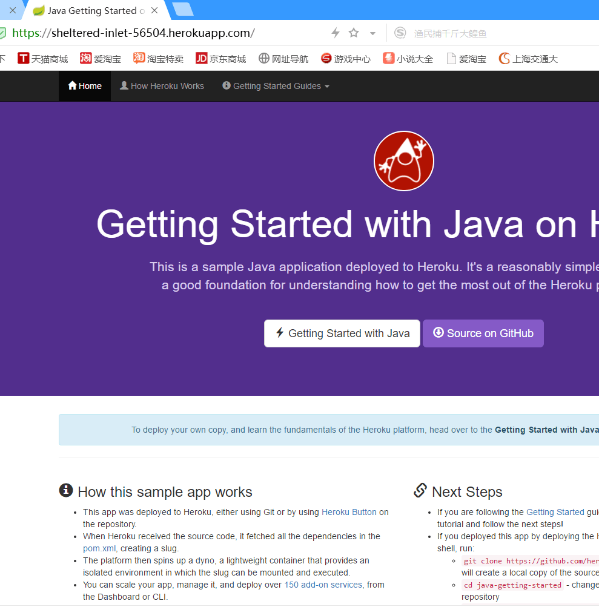
With the steps above, every time we make changes to our code and push the new project to github, CI will help us build and test at set intervals, while CD will deploy our project with a few command-line operations.